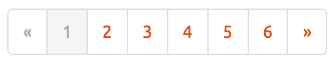

# ts-react-pager
Super simple pagination component.



*This sample uses [bootswatch theme](https://bootswatch.com/journal/) for css.

You can interact with this component on iOS browser, too !  
I haven't check on Android yet.

# install
```
npm install ts-react-pager
```

# usage

```
var Pager = require('ts-react-pager').Pager
var YourApp = React.createClass({
  handlePaging: function(pageNum) {
    this.setState({data:this.state.data, currentPage:pageNum})
  },
  render: function() {
    var o = {
      dataLength:this.props.data.length,  // Your data's length.
      handler: this.handlePaging,         // Gets called when page is changed. You must implement your own. Otherwise crashes.
      pageSize: this.props.pageSize,      // Max display count of your data.
      currentPage: this.state.currentPage // Your current page should be set in your state.
    }
    var pager = (<Pager object={o}>)
    return (
      <div>
        {pager}
        {yourtable}
        {pager}
      </div>
    )
  }
})
```
